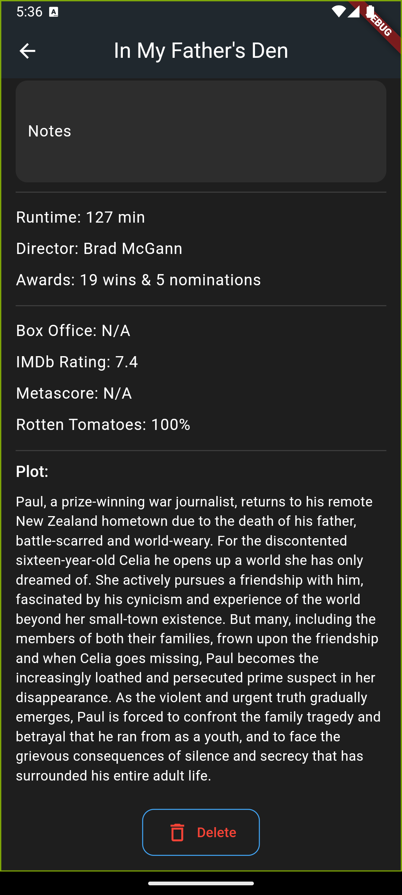

# Media Tracker

Flutter tv,movie tracker app using with OMDB api for my personal use. A personal media tracking application for movies, TV shows, and anime built with Flutter. Keep track of your watched content and manage your watchlist efficiently.

## Screenshots

### Home Screen


*Main dashboard showing library statistics and quick access to different media categories*

### Media List


*List view of TV shows with search functionality and rating display*

### Media Details



*Detailed view of media items showing comprehensive information including ratings, plot, and technical details*

### Watchlist


*Watchlist item with options to move to watched or remove from list*

## Features

- Track movies, TV shows, and anime
- Maintain a watchlist
- Search and add new media using OMDB API
- Rate and review watched content
- Import data via CSV
- Offline storage with SQLite
- Dark theme UI
- Cached image loading

## Setup

1. Ensure Flutter is installed on your system
2. Clone the repository
3. Install dependencies:
   ```bash
   flutter pub get
   ```
4. Run the application:
   ```bash
   flutter run
   ```

## Dependencies

- **flutter:** Core framework
- **provider:** State management
- **sqflite:** Local database
- **http:** API requests
- **cached_network_image:** Image caching
- **csv:** CSV file handling
- **file_picker:** File selection
- **permission_handler:** System permissions

## Usage

1. **Add Media:**
   - Search for movies/shows using the search button
   - Add items to your watchlist or mark as watched

2. **Track Progress:**
   - Rate watched content
   - Add personal notes
   - View detailed information

3. **Import Data:**
   - Import existing collections via CSV
   - Supported formats: movies, TV shows, anime

## Acknowledgments

- OMDB API for media information
